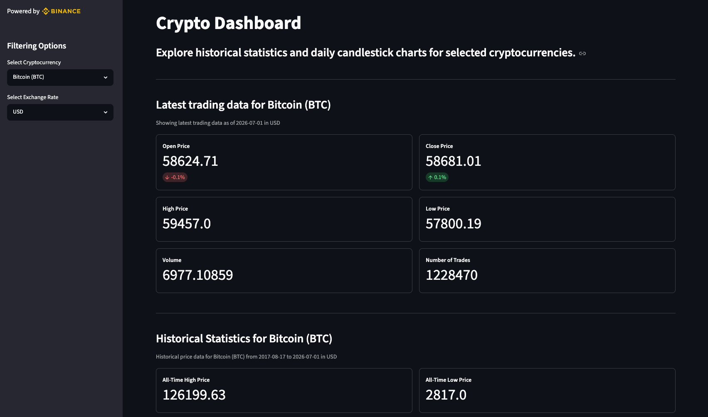
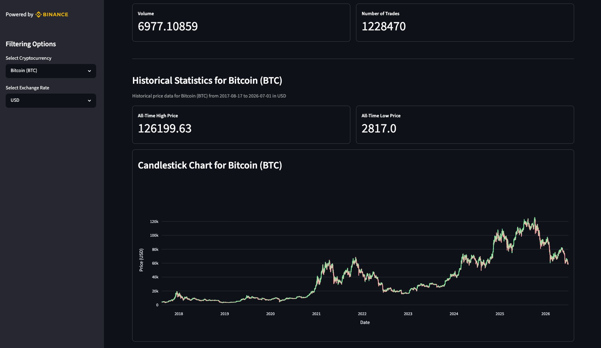

# Binance Crypto Data Platform


A full data service lifecycle pipeline that ingests historical cryptocurrency data from the Binance public API, stores it in PostgreSQL, serves it via FastAPI, and visualises it in a Streamlit dashboard — deployable with Docker Compose, Kubernetes, or serverless on AWS via Pulumi.

---

## Features

- Ingests historical daily OHLCV (Open, High, Low, Close, Volume) candle data for 6 cryptocurrencies from the Binance public API
- Stores data in PostgreSQL using `NUMERIC(20,8)` precision (no floats for financial data)
- Upsert logic — safe to re-run without duplicates
- FastAPI with Pydantic response models and optional date filtering
- Streamlit dashboard with live currency conversion and Plotly candlestick charts
- Deployable locally with Docker Compose or on a Kubernetes cluster with kind
- Deployable to AWS with Pulumi (IaC): Lambda + EventBridge (ingest), Lambda + API Gateway (API), RDS (database), ECS Fargate (dashboard)

---

## Dashboard

The Streamlit dashboard connects to the FastAPI and provides:

- **Latest trading data** — open, high, low and close price for the most recent candle, with percentage change between open and close
- **Historical statistics** — all-time high and all-time low across the full price history
- **Candlestick chart** — interactive Plotly chart showing the full OHLC history for the selected cryptocurrency

**Currency conversion** is handled at display time via the [Frankfurter API](https://www.frankfurter.app/). Prices are stored in USD and converted live to the selected currency — no historical exchange rates are stored.

Supported currencies: USD, EUR, SEK, NOK, DKK

---

## Cryptocurrencies

| Symbol | Name |
|--------|------|
| BTCUSDT | Bitcoin |
| ETHUSDT | Ethereum |
| XRPUSDT | Ripple |
| SOLUSDT | Solana |
| LINKUSDT | Chainlink |
| ADAUSDT | Cardano |

---

## Project Structure

```
src/
  fetch_and_ingest.py   # Binance API ingestion script
  api.py                # FastAPI app
  models.py             # Pydantic response models
  dashboard.py          # Streamlit dashboard
k8s/
  postgres-pvc.yaml         # PersistentVolumeClaim
  postgres-deployment.yaml  # Postgres Deployment
  postgres-service.yaml     # Postgres Service
  api-deployment.yaml       # API Deployment
  api-service.yaml          # API Service
  dashboard-deployment.yaml # Dashboard Deployment
  dashboard-service.yaml    # Dashboard Service
  ingest-job.yaml           # CronJob for daily ingest
infra/
  __main__.py           # Pulumi IaC (RDS, ECR, Lambda, API Gateway, EventBridge, ECS Fargate)
  Pulumi.yaml           # Pulumi project config
  requirements.txt      # Pulumi Python dependencies
dockerfile.ingest        # Docker image for ingest (local)
dockerfile.ingest.lambda # Docker image for ingest on AWS Lambda
dockerfile.api           # Docker image for API (local)
dockerfile.api.lambda    # Docker image for API on AWS Lambda (Mangum)
dockerfile.dashboard     # Docker image for dashboard (local + ECS Fargate)
docker-compose.yml      # Local orchestration
deploy.sh               # Full AWS deploy script
```

---

## Prerequisites

- [Docker](https://www.docker.com/)
- [kind](https://kind.sigs.k8s.io/) (for Kubernetes)
- [kubectl](https://kubernetes.io/docs/tasks/tools/) (for Kubernetes)

---

## Environment Variables

Copy `.env.example` and fill in your values:

```bash
cp .env.example .env
```

```
BASE_URL=https://api.binance.com/api/v3/klines
SYMBOLS=BTCUSDT,ETHUSDT,XRPUSDT,SOLUSDT,LINKUSDT,ADAUSDT
INTERVAL=1d
START_DATE=2000-01-01
DB_HOST=localhost
DB_NAME=binance_crypto_data
DB_USER=<your_postgres_user>
DB_PASSWORD=<your_postgres_password>
DB_PORT=5432
```

---

## Running with Docker Compose

```bash
docker compose up --build
```

This starts all four services in the correct order:

| Service | URL |
|---------|-----|
| Dashboard | http://localhost:8501 |
| API | http://localhost:8000 |
| PostgreSQL | localhost:5432 |

---

## Running with Kubernetes (kind)

### 1. Create the cluster

```bash
kind create cluster --name binance-crypto-cluster
```

### 2. Build and load images

```bash
docker build -f dockerfile.api -t binance_crypto_data_platform-api:latest .
docker build -f dockerfile.ingest -t binance_crypto_data_platform-ingest:latest .
docker build -f dockerfile.dashboard -t binance_crypto_data_platform-dashboard:latest .

kind load docker-image binance_crypto_data_platform-api:latest --name binance-crypto-cluster
kind load docker-image binance_crypto_data_platform-ingest:latest --name binance-crypto-cluster
kind load docker-image binance_crypto_data_platform-dashboard:latest --name binance-crypto-cluster
```

### 3. Create the secret

Create `k8s/postgres-secrets.yaml` (this file is gitignored):

```yaml
apiVersion: v1
kind: Secret
metadata:
  name: postgres-secret
type: Opaque
stringData:
  DB_USER: "<your_postgres_user>"
  DB_PASSWORD: "<your_postgres_password>"
  DB_PORT: "5432"
```

### 4. Apply manifests

```bash
kubectl apply -f k8s/postgres-secrets.yaml
kubectl apply -f k8s/postgres-pvc.yaml
kubectl apply -f k8s/postgres-deployment.yaml
kubectl apply -f k8s/postgres-service.yaml
kubectl apply -f k8s/api-deployment.yaml
kubectl apply -f k8s/api-service.yaml
kubectl apply -f k8s/dashboard-deployment.yaml
kubectl apply -f k8s/dashboard-service.yaml
kubectl apply -f k8s/ingest-job.yaml
```

### 5. Run ingest manually

```bash
kubectl create job ingest-manual --from=cronjob/ingest
```

### 6. Access the dashboard

```bash
kubectl port-forward service/dashboard 8501:8501
```

Open http://localhost:8501 in your browser.

---

## Deployment (AWS)

The full stack can also be deployed to AWS using [Pulumi](https://www.pulumi.com/) (Infrastructure as Code, Python):

- **Ingest** → AWS Lambda, triggered daily by an EventBridge cron schedule
- **API** → AWS Lambda + API Gateway (FastAPI via the [Mangum](https://mangum.io/) adapter)
- **Database** → AWS RDS for PostgreSQL
- **Dashboard** → AWS ECS Fargate (Streamlit is a long-lived server and does not fit Lambda), reachable on port 8501 via the task's public IP

### Prerequisites

- [AWS CLI](https://aws.amazon.com/cli/) configured with a profile that has permissions for RDS, Lambda, ECR, API Gateway, EventBridge and IAM
- [Pulumi CLI](https://www.pulumi.com/docs/install/), local state mode (`pulumi login --local`)
- Add these to your `.env` (see `.env.example`):

```
AWS_ACCOUNT_ID=<your_aws_account_id>
AWS_REGION=<your_aws_region>
AWS_PROFILE=<your_aws_profile>
```

### Deploy

```bash
./deploy.sh
```

This provisions the infrastructure, builds and pushes the Docker images to ECR, then rolls out the Lambda functions, API Gateway and the Fargate dashboard in the correct order. On completion it prints the API Gateway URL and the dashboard URL.

The Pulumi program detects per ECR repo whether an image has been pushed and only deploys the services whose images exist — so the same script works for a first deploy from scratch, day-to-day updates, and adding new services. Services reference images by digest, so image updates roll out in-place and the API URL stays stable between deploys.

`deploy.sh` is self-contained — it sources `.env` and points Pulumi at `infra/.pulumi-passphrase` itself, so it works in a brand new terminal with no manual exports. Just make sure `.env` and `infra/.pulumi-passphrase` exist, and run it from the project root.

Note: the dashboard's public IP changes when the Fargate task restarts — re-run the lookup in `deploy.sh` (or see [notes/aws-operations.md](notes/aws-operations.md)) to find the current one.

### Tear down

```bash
cd infra
pulumi destroy
```

Removes all AWS resources created by the stack (RDS, Lambdas, ECR repos, API Gateway, EventBridge rule, IAM roles, ECS cluster/service).

---

## API Endpoints

| Method | Endpoint | Description |
|--------|----------|-------------|
| GET | `/health` | Health check |
| GET | `/candles/{symbol}` | Full price history (optional `from_date` / `to_date`) |
| GET | `/candles/{symbol}/latest` | Latest candle for a symbol |

---

## Useful Commands

### Docker

```bash
# Build all images
docker build -f dockerfile.api -t binance_crypto_data_platform-api:latest .
docker build -f dockerfile.ingest -t binance_crypto_data_platform-ingest:latest .
docker build -f dockerfile.dashboard -t binance_crypto_data_platform-dashboard:latest .

# Start the full stack
docker compose up --build

# Start in the background
docker compose up --build -d

# Stop all services
docker compose down

# Stop and remove volumes (deletes all data)
docker compose down -v

# View logs for a specific service
docker compose logs api
docker compose logs ingest

# Follow logs in real time
docker compose logs -f api

# List running containers
docker ps

# List all containers (including stopped)
docker ps -a

# List all local images
docker images

# Remove a specific image
docker rmi <image-name>

# Remove all unused images (frees up disk space)
docker image prune

# Open a shell inside a running container (useful for debugging)
docker exec -it <container-name> bash

# View resource usage for running containers (CPU, memory, network)
docker stats
```

### Kubernetes (kind)

```bash
# Create the cluster
kind create cluster --name binance-crypto-cluster

# Delete the cluster
kind delete cluster --name binance-crypto-cluster

# Load images into the cluster
kind load docker-image binance_crypto_data_platform-api:latest --name binance-crypto-cluster
kind load docker-image binance_crypto_data_platform-ingest:latest --name binance-crypto-cluster
kind load docker-image binance_crypto_data_platform-dashboard:latest --name binance-crypto-cluster

# Apply all manifests
kubectl apply -f k8s/

# Delete all resources
kubectl delete -f k8s/

# Check pod status
kubectl get pods

# View logs for a deployment
kubectl logs deployment/api
kubectl logs deployment/dashboard

# Restart a deployment
kubectl rollout restart deployment/api

# Trigger ingest manually
kubectl create job ingest-manual --from=cronjob/ingest

# Delete a manual job
kubectl delete job ingest-manual

# Port-forward dashboard
kubectl port-forward service/dashboard 8501:8501

# Port-forward API
kubectl port-forward service/api 8000:8000

# Resume after restarting Docker Desktop (cluster already exists)
kubectl config use-context kind-binance-crypto-cluster
kubectl get pods
```

### PostgreSQL

```bash
# Connect to local Postgres
psql -U <your_postgres_user> -d binance_crypto_data

# Connect to Postgres inside Kubernetes
kubectl exec -it deployment/postgres -- psql -U <your_postgres_user> -d binance_crypto_data

# Useful queries
SELECT COUNT(*) FROM crypto_daily_candles;
SELECT DISTINCT symbol FROM crypto_daily_candles;
SELECT * FROM crypto_daily_candles WHERE symbol = 'BTCUSDT' ORDER BY open_time DESC LIMIT 5;
```

---

## Screenshots



